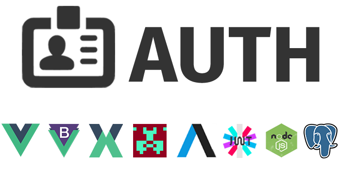

# Vue.js - Autenticação de usuários 

<p align="center">
  
p>

Projeto de autenticação em vue com cadastro de usuários e login.

VueJS + Vuex + Axios + Bootstrap-Vue + Vue-Gravatar + Vue-Toasted + JWT + Backend NodeJS + PostgreSQL

## Instalando dependências do projeto backend
```
npm install
```

## Criação do banco de dados PostgreSQL
```
CREATE DATABASE auth WITH OWNER = postgres ENCODING = 'UTF8';

CREATE TABLE public.users (
  id SERIAL,
  name VARCHAR(100),
  email VARCHAR(100),
  password VARCHAR(100),
  admin BOOLEAN DEFAULT false,
  "deletedAt" TIMESTAMP(0) WITHOUT TIME ZONE,  
  CONSTRAINT users_email_key UNIQUE(email),
  CONSTRAINT users_pkey PRIMARY KEY(id)
) 
WITH (oids = false);

ALTER TABLE public.users ALTER COLUMN id SET STATISTICS 0;

ALTER TABLE public.users OWNER TO postgres;

/* 
  Usuário Mock Default: admin@gmail.com - Senha: 123  
*/
INSERT INTO public.users ("id", "name", "email", "password", "admin")
VALUES (1, 
	E'Admin', 
	E'admin@gmail.com', 
	E'$2a$10$rQMnhydle5AS7Lii7riM.ewWV0iG3zNFJUUXEHa2nKJ6hB9KNhUeK', True);  

```

## Arquivo .env 
```
Script para criação do banco de dados, exemplo:

	CREATE DATABASE auth WITH OWNER = postgres ENCODING = 'UTF8';

	CREATE TABLE public.users (
	  id SERIAL,
	  name VARCHAR(100),
	  email VARCHAR(100),
	  password VARCHAR(100),
	  admin BOOLEAN DEFAULT false,
	  "deletedAt" TIMESTAMP(0) WITHOUT TIME ZONE,  
	  CONSTRAINT users_email_key UNIQUE(email),
	  CONSTRAINT users_pkey PRIMARY KEY(id)
	) 
	WITH (oids = false);

	ALTER TABLE public.users ALTER COLUMN id SET STATISTICS 0;

	ALTER TABLE public.users OWNER TO postgres;

	/* 
	  Usuário Mock Default: admin@gmail.com - Senha: 123  
	*/
	INSERT INTO public.users ("id", "name", "email", "password", "admin")
	VALUES (1, E'Admin', E'admin@gmail.com', E'$2a$10$rQMnhydle5AS7Lii7riM.ewWV0iG3zNFJUUXEHa2nKJ6hB9KNhUeK', True);  

```

## Arquivo .env 
```
Configurar sua chave secreta para jwt e seu banco de dados, exemplo:

module.exports = {
	authSecret: 'your-secret-jwt',
	db: {
		host: '127.0.0.1',
		database: 'auth',
		user:     'postgres',
		password: '1234'
	}
}
	
```

### Compilação para desenvolvimento
```
npm start
```

## Instalando dependências do projeto frontend
```
npm install
```

### Compilação para desenvolvimento
```
npm run serve
```

### Compilação e minificação para produção
```
npm run build

```

### Personalizar configuração

Consulte [Referência de configuração] (https://cli.vuejs.org/config/).

## Licença

The MIT License (MIT)

Copyright (c) 2021 Everson Clei

Permission is hereby granted, free of charge, to any person obtaining a copy of this software and associated documentation files (the "Software"), to deal in the Software without restriction, including without limitation the rights to use, copy, modify, merge, publish, distribute, sublicense, and/or sell copies of the Software, and to permit persons to whom the Software is furnished to do so, subject to the following conditions:

The above copyright notice and this permission notice shall be included in all copies or substantial portions of the Software.

THE SOFTWARE IS PROVIDED "AS IS", WITHOUT WARRANTY OF ANY KIND, EXPRESS OR IMPLIED, INCLUDING BUT NOT LIMITED TO THE WARRANTIES OF MERCHANTABILITY, FITNESS FOR A PARTICULAR PURPOSE AND NONINFRINGEMENT. IN NO EVENT SHALL THE AUTHORS OR COPYRIGHT HOLDERS BE LIABLE FOR ANY CLAIM, DAMAGES OR OTHER LIABILITY, WHETHER IN AN ACTION OF CONTRACT, TORT OR OTHERWISE, ARISING FROM, OUT OF OR IN CONNECTION WITH THE SOFTWARE OR THE USE OR OTHER DEALINGS IN THE SOFTWARE.
